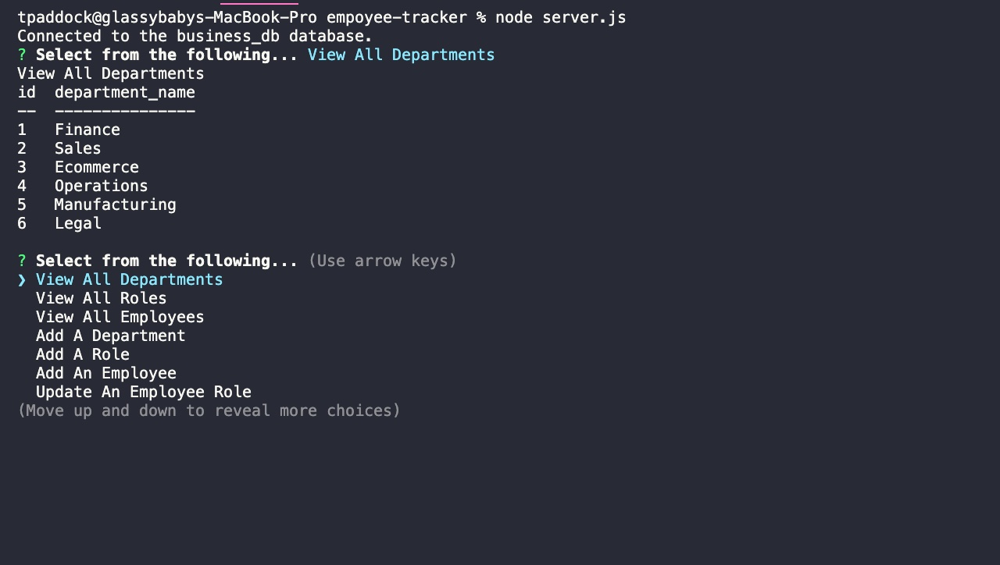

# empoyee-tracker

## Description

Create an Employee Tracker using node.js, inquirer and MySQL so a business can keep track of their employees, their roles, the different departments and they are able to add new roles, as well as, add and update new employees.

## Installation

Git clone this repo using your SSH key. In Visual Studio Code or a similar application open your integrated terminal of this project and run 'npm install'. This will download all packages needed to run the application.

## Usage

Make sure to update your password for MySQL in the server.js file. Type in 'node server.js' to run the application. This will run in the command line of your terminal
 
 
Screenshots
 
 
Menu

 
 
Departments Table

 
 
Roles Table

 
 
Employees Table

 
 
Adding a Department

 
 
Adding a Role

 
 
Adding an Employee

 
 
Updating an Employee

## Credits

Used help from UW BOOTCAMP week 12 and the week 12 mini project.

## How to Contribute

Update so that you can delete the roles, employees or departments you no longer want to see.  
Turn this into a functioning web application.